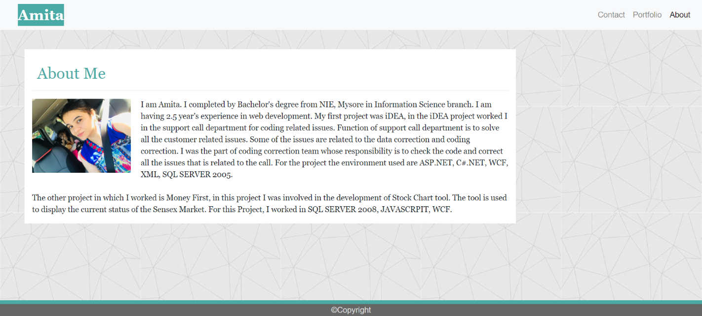

# Portfolio

## Contents

* [Introduction](#Introduction)
* [Technologies](#Technologies)
* [Screenshot](#Screenshot)
* [Link](#Link)

## Introduction

My portfolio project contains three tabs.

* about: display a short introduction of the profile owner.
* portfolio: display link to all the project done.
* contact: provides the form to add the name email and message.

This project use the Bootsrap 4 features. Therefore ,it provides responsive layout for desktop, tab and mobile screen.

## Technologies

Project is created with:

* Visual Studio Code 1.51.1
* Bootstrap 4

## Screenshot

## Link

[Portfolio](https://panwaramita.github.io/Updated-Portfolio/)
